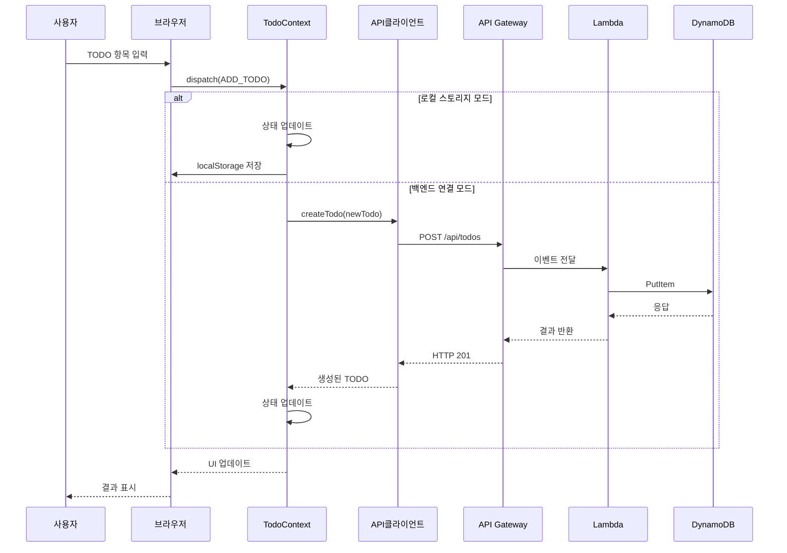
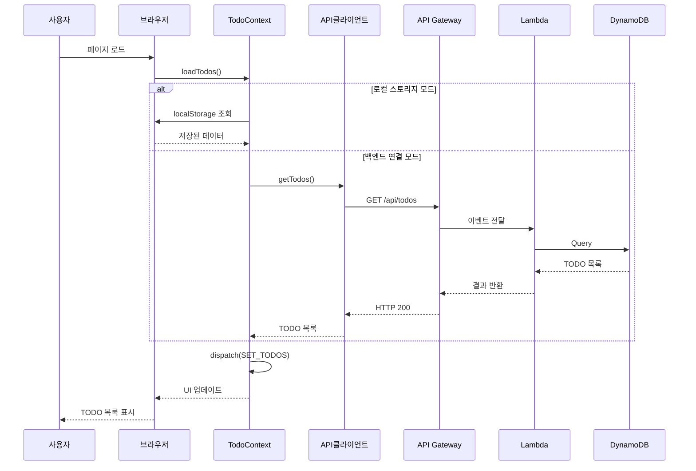

# TODO 웹 애플리케이션 설계 문서

## 1. 아키텍처 개요

이 문서는 TODO 웹 애플리케이션의 아키텍처 및 설계 방향을 정의합니다. 이 애플리케이션은 Clean Architecture와 SOLID 원칙을 기반으로 설계되었습니다.

### 1.1 전체 아키텍처


### 1.2 개발 단계

1. **1단계**: 프론트엔드 구현 (로컬 스토리지 사용)
2. **2단계**: 백엔드 API 구현 (AWS 서버리스)
3. **3단계**: 인증 시스템 통합 (AWS Cognito)
4. **4단계**: 배포 및 CI/CD 구성

## 2. 프론트엔드 설계

### 2.1 컴포넌트 구조


### 2.2 디렉토리 구조

```
src/
├── assets/            # 이미지, 아이콘 등 정적 자산
├── components/        # 재사용 가능한 UI 컴포넌트
│   ├── common/        # 공통 컴포넌트 (버튼, 입력 필드 등)
│   ├── layout/        # 레이아웃 관련 컴포넌트
│   └── todo/          # Todo 관련 컴포넌트
├── contexts/          # React Context API
├── hooks/             # 커스텀 훅
├── pages/             # 페이지 컴포넌트
├── services/          # 외부 서비스 통신 로직
│   ├── api/           # API 클라이언트
│   └── storage/       # 로컬 스토리지 관리
├── types/             # TypeScript 타입 정의
├── utils/             # 유틸리티 함수
└── App.tsx            # 애플리케이션 진입점
```

### 2.3 상태 관리

React Context API와 useReducer를 사용하여 상태 관리를 구현합니다.

```typescript
// Todo 상태 타입 정의
interface Todo {
  id: string;
  title: string;
  priority: 'low' | 'medium' | 'high';
  completed: boolean;
  createdAt: string;
}

// Todo 상태 액션 타입
type TodoAction =
  | { type: 'ADD_TODO'; payload: Omit<Todo, 'id' | 'createdAt'> }
  | { type: 'UPDATE_TODO'; payload: Todo }
  | { type: 'DELETE_TODO'; payload: string }
  | { type: 'TOGGLE_TODO'; payload: string }
  | { type: 'SET_TODOS'; payload: Todo[] };

// Todo 상태 리듀서
const todoReducer = (state: Todo[], action: TodoAction): Todo[] => {
  switch (action.type) {
    case 'ADD_TODO':
      return [
        ...state,
        {
          id: Date.now().toString(),
          ...action.payload,
          createdAt: new Date().toISOString(),
        },
      ];
    case 'UPDATE_TODO':
      return state.map((todo) =>
        todo.id === action.payload.id ? action.payload : todo
      );
    case 'DELETE_TODO':
      return state.filter((todo) => todo.id !== action.payload);
    case 'TOGGLE_TODO':
      return state.map((todo) =>
        todo.id === action.payload
          ? { ...todo, completed: !todo.completed }
          : todo
      );
    case 'SET_TODOS':
      return action.payload;
    default:
      return state;
  }
};
```

### 2.4 스토리지 전략

초기에는 로컬 스토리지를 사용하고, 백엔드 구현 후에는 API 클라이언트로 전환합니다.

```typescript
// 스토리지 인터페이스
interface StorageService {
  getTodos(): Promise<Todo[]>;
  saveTodos(todos: Todo[]): Promise<void>;
}

// 로컬 스토리지 구현
class LocalStorageService implements StorageService {
  private readonly STORAGE_KEY = 'todos';

  async getTodos(): Promise<Todo[]> {
    const data = localStorage.getItem(this.STORAGE_KEY);
    return data ? JSON.parse(data) : [];
  }

  async saveTodos(todos: Todo[]): Promise<void> {
    localStorage.setItem(this.STORAGE_KEY, JSON.stringify(todos));
  }
}

// API 클라이언트 구현 (백엔드 연결 후)
class ApiStorageService implements StorageService {
  async getTodos(): Promise<Todo[]> {
    const response = await fetch('/api/todos');
    return response.json();
  }

  async saveTodos(todos: Todo[]): Promise<void> {
    // 실제 구현에서는 개별 항목별로 API 호출
    // 여기서는 간단히 표현
  }
}
```

## 3. 백엔드 설계

### 3.1 API 엔드포인트

| 엔드포인트 | 메서드 | 설명 | 요청 본문 | 응답 |
|------------|--------|------|-----------|------|
| `/api/todos` | GET | 사용자의 모든 Todo 항목 조회 | - | Todo[] |
| `/api/todos` | POST | 새 Todo 항목 생성 | Todo 객체 | 생성된 Todo |
| `/api/todos/{id}` | GET | 특정 Todo 항목 조회 | - | Todo |
| `/api/todos/{id}` | PUT | 특정 Todo 항목 수정 | Todo 객체 | 수정된 Todo |
| `/api/todos/{id}` | DELETE | 특정 Todo 항목 삭제 | - | 성공 메시지 |

### 3.2 데이터 모델

#### DynamoDB 테이블 설계

**Todos 테이블**:
- 파티션 키: `userId` (Cognito 사용자 ID)
- 정렬 키: `id` (Todo 항목 ID)
- 속성:
  - `title`: 문자열
  - `priority`: 문자열 ('low', 'medium', 'high')
  - `completed`: 불리언
  - `createdAt`: 문자열 (ISO 날짜)

### 3.3 Lambda 함수

각 API 엔드포인트에 대해 별도의 Lambda 함수를 구현합니다:

1. `getTodos`: 사용자의 모든 Todo 항목 조회
2. `createTodo`: 새 Todo 항목 생성
3. `getTodo`: 특정 Todo 항목 조회
4. `updateTodo`: 특정 Todo 항목 수정
5. `deleteTodo`: 특정 Todo 항목 삭제

### 3.4 인증 및 권한 부여

AWS Cognito를 사용하여 사용자 인증을 구현합니다:

1. 사용자 풀 생성
2. 앱 클라이언트 설정
3. API Gateway와 통합
4. JWT 토큰 검증

### 3.5 API 요청 처리 시퀀스

다음은 TODO 항목 생성 및 조회에 대한 시퀀스 다이어그램입니다:

#### TODO 항목 생성 시퀀스



#### TODO 항목 조회 시퀀스



## 4. 테스트 전략

### 4.1 프론트엔드 테스트

1. **단위 테스트**: Jest를 사용하여 개별 컴포넌트, 훅, 유틸리티 함수 테스트
2. **통합 테스트**: React Testing Library를 사용하여 컴포넌트 통합 테스트
3. **E2E 테스트**: Cypress를 사용하여 전체 사용자 흐름 테스트

### 4.2 백엔드 테스트

1. **단위 테스트**: Jest를 사용하여 Lambda 함수 로직 테스트
2. **통합 테스트**: AWS SDK를 사용하여 DynamoDB 통합 테스트
3. **API 테스트**: Postman 또는 Insomnia를 사용하여 API 엔드포인트 테스트

### 4.3 TDD 접근 방식

코어 비즈니스 로직 구현 시 TDD(테스트 주도 개발) 접근 방식을 사용합니다:

1. 실패하는 테스트 작성
2. 테스트를 통과하는 최소한의 코드 작성
3. 코드 리팩토링
4. 반복

## 5. UI/UX 설계

### 5.1 디자인 원칙

1. 모바일 우선 디자인
2. 직관적인 사용자 인터페이스
3. 접근성 고려 (WCAG 2.1 AA 수준)
4. 다크 모드/라이트 모드 지원

### 5.2 와이어프레임

#### 모바일 뷰 (리스트 형태)


#### 데스크톱 뷰 (리스트 형태)


## 6. 배포 전략

### 6.1 프론트엔드 배포

1. GitHub Actions를 사용한 CI/CD 파이프라인 구성
2. GitHub Pages에 정적 웹 사이트 배포

### 6.2 백엔드 배포

1. AWS CDK를 사용하여 인프라 정의
2. GitHub Actions를 사용한 자동 배포 구성

### 6.3 환경 구성

1. **개발 환경**: 로컬 개발 및 테스트
2. **스테이징 환경**: 테스트 및 QA
3. **프로덕션 환경**: 최종 사용자용

## 7. 구현 계획

### 7.1 1단계: 프론트엔드 초기 구현 (로컬 스토리지)

1. 프로젝트 설정 (React + Vite + TypeScript)
2. 기본 UI 컴포넌트 구현
3. 상태 관리 구현 (Context API + useReducer)
4. 로컬 스토리지 통합
5. 테스트 작성

### 7.2 2단계: 백엔드 구현

1. AWS CDK 프로젝트 설정
2. DynamoDB 테이블 정의
3. Lambda 함수 구현
4. API Gateway 설정
5. 테스트 작성

### 7.3 3단계: 인증 시스템 구현

1. Cognito 사용자 풀 설정
2. 로그인/회원가입 UI 구현
3. 인증 통합
4. 테스트 작성

### 7.4 4단계: 프론트엔드-백엔드 통합

1. API 클라이언트 구현
2. 로컬 스토리지에서 API로 전환
3. 통합 테스트
4. 버그 수정 및 최적화

### 7.5 5단계: 배포 및 CI/CD

1. GitHub Actions 워크플로우 설정
2. 프론트엔드 배포 자동화
3. 백엔드 배포 자동화
4. 최종 테스트 및 검증

## 8. 결론

이 설계 문서는 TODO 웹 애플리케이션의 아키텍처, 컴포넌트, 데이터 모델, 테스트 전략 및 구현 계획을 정의합니다. Clean Architecture와 SOLID 원칙을 기반으로 설계되었으며, 확장성과 유지보수성을 고려했습니다.

이 문서는 프로젝트 진행 과정에서 업데이트될 수 있습니다.
